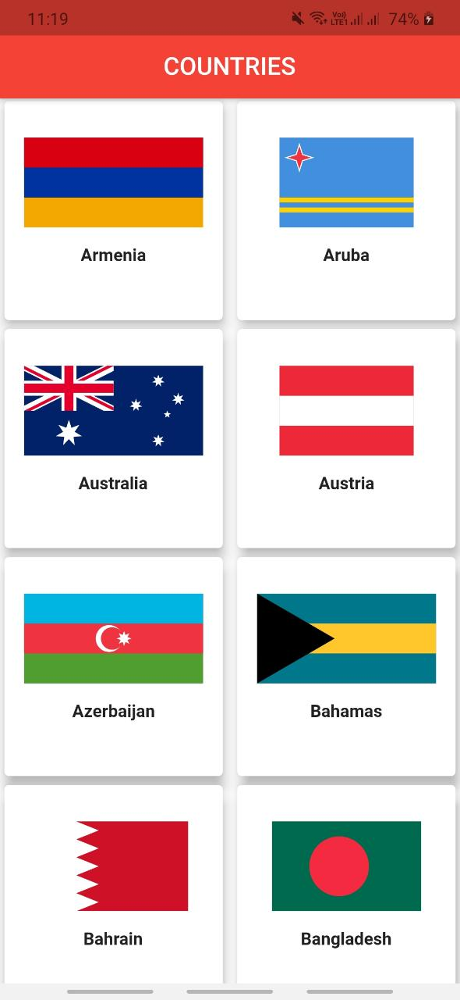
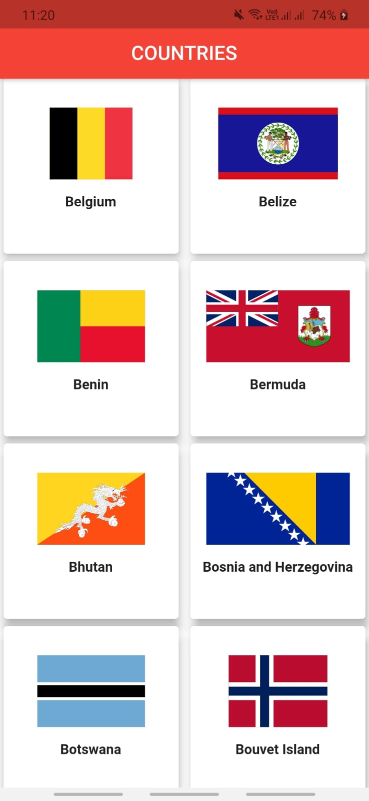
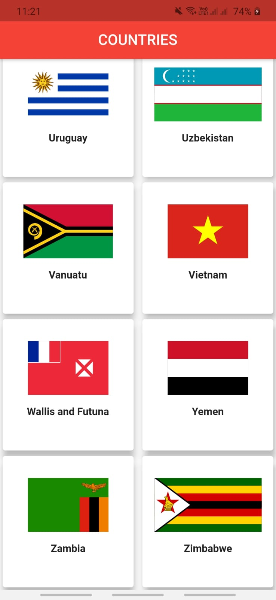

# Countries And Flags (BASIC API CALLING)

This is the Fluteer project based on the basic API calling. In this project the Countries and their Flags are displayed in the ListView with the help of Postman API.

## Dependencies Used

## ScreenShots

### Image1

### Image2

### Image3

## Getting Started

This project is a starting point for a Flutter application.

A few resources to get you started if this is your first Flutter project:

- [Lab: Write your first Flutter app](https://flutter.dev/docs/get-started/codelab)
- [Cookbook: Useful Flutter samples](https://flutter.dev/docs/cookbook)

For help getting started with Flutter, view our
[online documentation](https://flutter.dev/docs), which offers tutorials,
samples, guidance on mobile development, and a full API reference.
